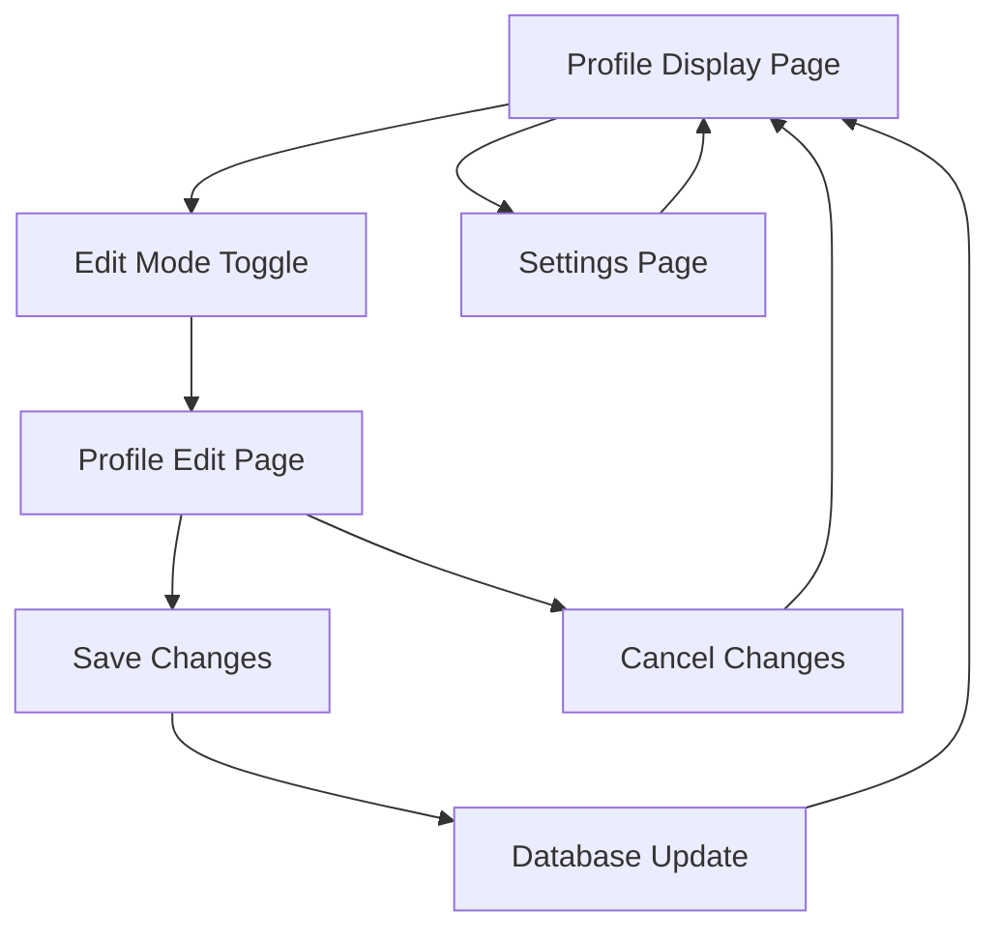

# PhotoShare App Extension - Product Requirements Document

## 1. Product Overview

Extend the existing PhotoShare application to enable users to edit their personal profile information including name, surname, and profile picture. The enhanced application will provide a seamless editing experience with persistent data storage through MongoDB integration.

- **Primary Goal**: Transform the static profile display into a dynamic, editable user profile management system
- **Target Users**: Individual users who want to maintain and update their personal profile information
- **Business Value**: Increased user engagement and data accuracy through self-service profile management

## 2. Core Features

### 2.1 User Roles

| Role | Registration Method | Core Permissions |
|------|---------------------|------------------|
| Profile Owner | Direct access (no authentication required for MVP) | Can view and edit their own profile information |

### 2.2 Feature Module

Our PhotoShare extension consists of the following main pages:

1. **Profile Display Page**: Enhanced profile view with edit capabilities, profile information display, edit mode toggle
2. **Profile Edit Page**: Dedicated editing interface, form validation, image upload functionality, save/cancel actions
3. **Settings Page**: Application preferences, data management options

### 2.3 Page Details

| Page Name | Module Name | Feature description |
|-----------|-------------|---------------------|
| Profile Display | Profile View | Display current name, surname, and profile picture with edit button |
| Profile Display | Edit Toggle | Switch between view and edit modes seamlessly |
| Profile Edit | Name Editor | Input fields for first name and surname with validation |
| Profile Edit | Image Upload | File upload component for profile picture with preview |
| Profile Edit | Form Actions | Save changes to database, cancel edits, reset to original values |
| Profile Edit | Validation | Real-time form validation and error messaging |
| Settings | Data Management | Export profile data, reset profile to defaults |

## 3. Core Process

**Main User Flow:**
1. User views their current profile on the main page
2. User clicks "Edit Profile" button to enter edit mode
3. User modifies name, surname, or uploads new profile picture
4. System validates input in real-time
5. User saves changes, which are persisted to MongoDB
6. User returns to view mode with updated information displayed

**Alternative Flow - Cancel Edits:**
1. User enters edit mode and makes changes
2. User clicks "Cancel" button
3. System discards unsaved changes and returns to view mode

## 4. User Interface Design

### 4.1 Design Style

- **Primary Colors**: Blue gradient (#3B82F6 to #1E40AF), White (#FFFFFF)
- **Secondary Colors**: Gray tones (#6B7280, #F3F4F6), Success green (#10B981), Error red (#EF4444)
- **Button Style**: Rounded corners (8px), subtle shadows, hover animations
- **Typography**: Inter font family, 16px base size, 24px headings
- **Layout Style**: Card-based design, centered layout, responsive grid system
- **Icons**: Heroicons outline style, 20px standard size

### 4.2 Page Design Overview

| Page Name | Module Name | UI Elements |
|-----------|-------------|-------------|
| Profile Display | Profile Card | Centered white card with shadow, rounded profile image (128px), name typography (24px bold), edit button (blue, rounded) |
| Profile Edit | Edit Form | Form layout with labeled inputs, file upload dropzone, action buttons (save/cancel), validation messages |
| Profile Edit | Image Preview | Circular image preview (128px), upload progress indicator, file type validation |
| Settings | Options Panel | List-style settings with toggle switches, action buttons for data operations |

### 4.3 Responsiveness

Desktop-first approach with mobile-adaptive breakpoints. Touch-optimized interactions for mobile devices including larger touch targets (44px minimum) and swipe gestures for navigation.

