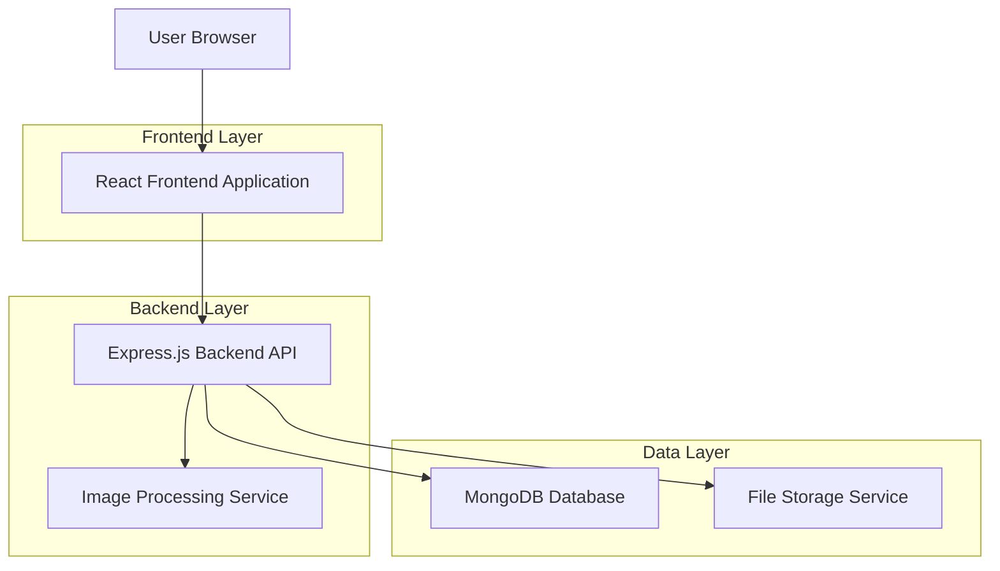
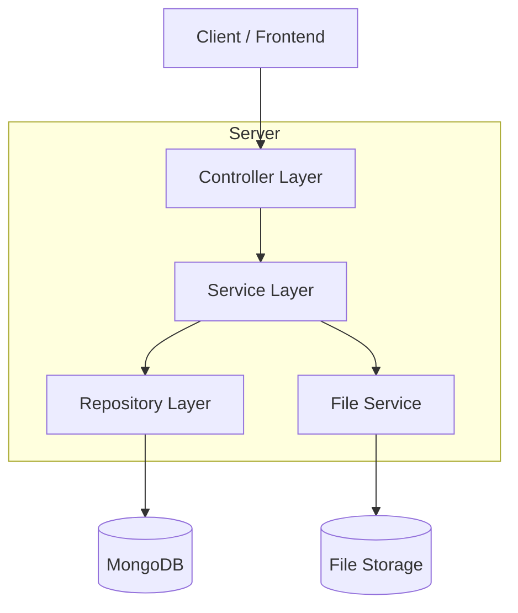
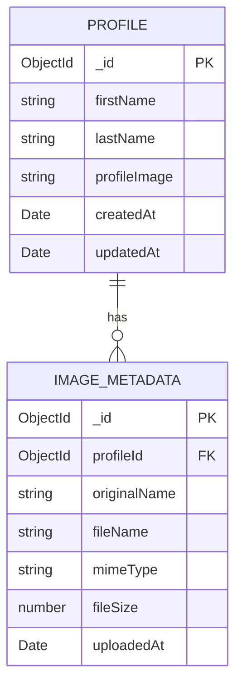

# PhotoShare Extension - Technical Architecture Document

## 1. Architecture Design



## 2. Technology Description

* **Frontend**: React\@18 + TypeScript + Tailwind CSS + Vite

* **Backend**: Express\@4 + Node.js + TypeScript

* **Database**: MongoDB with Mongoose ODM

* **File Storage**: Local file system (development) / Cloud storage (production)

* **Image Processing**: Sharp for image optimization and resizing

## 3. Route Definitions

| Route        | Purpose                                  |
| ------------ | ---------------------------------------- |
| /            | Home page displaying the user profile    |
| /edit        | Profile editing page with form interface |
| /settings    | Application settings and data management |
| /api/profile | API endpoint for profile data operations |
| /api/upload  | API endpoint for image upload handling   |

## 4. API Definitions

### 4.1 Core API

**Profile Management**

```
GET /api/profile
```

Response:

| Param Name   | Param Type | Description                 |
| ------------ | ---------- | --------------------------- |
| id           | string     | Unique profile identifier   |
| firstName    | string     | User's first name           |
| lastName     | string     | User's last name            |
| profileImage | string     | URL/path to profile image   |
| updatedAt    | string     | Last modification timestamp |

Example Response:

```json
{
  "id": "64f8a1b2c3d4e5f6a7b8c9d0",
  "firstName": "Kheepo",
  "lastName": "Motsinoi",
  "profileImage": "/uploads/profile-64f8a1b2c3d4e5f6a7b8c9d0.jpg",
  "updatedAt": "2024-01-15T10:30:00Z"
}
```

```
PUT /api/profile
```

Request:

| Param Name | Param Type | isRequired | Description        |
| ---------- | ---------- | ---------- | ------------------ |
| firstName  | string     | true       | Updated first name |
| lastName   | string     | true       | Updated last name  |

Example Request:

```json
{
  "firstName": "Kheepo",
  "lastName": "Motsinoi"
}
```

Response:

| Param Name | Param Type | Description          |
| ---------- | ---------- | -------------------- |
| success    | boolean    | Operation status     |
| profile    | object     | Updated profile data |

**Image Upload**

```
POST /api/upload
```

Request: Multipart form data

| Param Name | Param Type | isRequired | Description                            |
| ---------- | ---------- | ---------- | -------------------------------------- |
| image      | file       | true       | Profile image file (JPEG/PNG, max 5MB) |

Response:

| Param Name | Param Type | Description           |
| ---------- | ---------- | --------------------- |
| success    | boolean    | Upload status         |
| imageUrl   | string     | URL of uploaded image |
| message    | string     | Status message        |

## 5. Server Architecture Diagram



## 6. Data Model

### 6.1 Data Model Definition



### 6.2 Data Definition Language

**Profile Collection (profiles)**

```javascript
// MongoDB Schema Definition
const profileSchema = new mongoose.Schema({
  firstName: {
    type: String,
    required: true,
    trim: true,
    maxLength: 50
  },
  lastName: {
    type: String,
    required: true,
    trim: true,
    maxLength: 50
  },
  profileImage: {
    type: String,
    default: '/default-avatar.jpg'
  }
}, {
  timestamps: true
});

// Create indexes
profileSchema.index({ firstName: 1, lastName: 1 });
profileSchema.index({ updatedAt: -1 });
```

**Image Metadata Collection (image\_metadata)**

```javascript
const imageMetadataSchema = new mongoose.Schema({
  profileId: {
    type: mongoose.Schema.Types.ObjectId,
    ref: 'Profile',
    required: true
  },
  originalName: {
    type: String,
    required: true
  },
  fileName: {
    type: String,
    required: true,
    unique: true
  },
  mimeType: {
    type: String,
    required: true,
    enum: ['image/jpeg', 'image/png', 'image/webp']
  },
  fileSize: {
    type: Number,
    required: true,
    max: 5242880 // 5MB limit
  }
}, {
  timestamps: true
});

// Create indexes
imageMetadataSchema.index({ profileId: 1 });
imageMetadataSchema.index({ fileName: 1 }, { unique: true });
```

**Initial Data Setup**

```javascript
// Default profile data
const defaultProfile = {
  firstName: "Kheepo",
  lastName: "Motsinoi",
  profileImage: "/kheepo-profile.jpg"
};

// Insert default profile if none exists
Profile.findOneAndUpdate(
  {},
  defaultProfile,
  { upsert: true, new: true }
);
```

